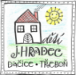

# Programování pro pokročilé

Tato stránka slouží pro projití kódů a přednášek ze cvičení. Zároveň zde budu dávat odkazy na různé tutoriály.

> A curated list of awesome READMEs

Elements in beautiful READMEs include, but are not limited to: images, screenshots, GIFs, text formatting, etc.

## Prezentace

|    | Téma | Materiály |
|---:|------|-----------|
|  1 |      |           |
|  2 |      |           |
|  3 |      |           |
|  4 |      |           |
|  5 |      |           |
|  6 |      |           |
|  7 |      |           |
|  8 |      |           |
|  9 |      |           |
| 10 |      |           |
| 11 |      |           |
| 12 |      |           |
| 13 |      |           |
| 14 |      |           |

- [Úvod](https://github.com/nohavond/ddmjh-python/blob/main/lab_01/uvod.pdf)

## Kódy
-

## Návody

- Jak nainstalovat Visual studio code [zde](https://studuj.digital/2020/07/20/jak-nainstalovat-visual-studio-2/).
- 